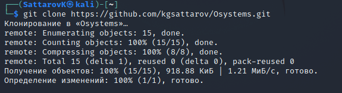
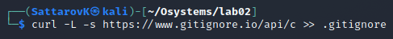

---
# Front matter
lang: ru-RU
title: "Лабораторная работа №3"
subtitle: "Дисциплина: Операционные системы"
author: "Саттаров Константин Григорьевич"

# Formatting
toc-title: "Содержание"
toc: true # Table of contents
toc_depth: 2
lof: true # List of figures
lot: true # List of tables
fontsize: 12pt
linestretch: 1.5
papersize: a4paper
documentclass: scrreprt
polyglossia-lang: russian
polyglossia-otherlangs: english
mainfont: PT Serif
romanfont: PT Serif
sansfont: PT Sans
monofont: PT Mono
mainfontoptions: Ligatures=TeX
romanfontoptions: Ligatures=TeX
sansfontoptions: Ligatures=TeX,Scale=MatchLowercase
monofontoptions: Scale=MatchLowercase
indent: true
pdf-engine: lualatex
header-includes:
  - \linepenalty=10 # the penalty added to the badness of each line within a paragraph (no associated penalty node) Increasing the value makes tex try to have fewer lines in the paragraph.
  - \interlinepenalty=0 # value of the penalty (node) added after each line of a paragraph.
  - \hyphenpenalty=50 # the penalty for line breaking at an automatically inserted hyphen
  - \exhyphenpenalty=50 # the penalty for line breaking at an explicit hyphen
  - \binoppenalty=700 # the penalty for breaking a line at a binary operator
  - \relpenalty=500 # the penalty for breaking a line at a relation
  - \clubpenalty=150 # extra penalty for breaking after first line of a paragraph
  - \widowpenalty=150 # extra penalty for breaking before last line of a paragraph
  - \displaywidowpenalty=50 # extra penalty for breaking before last line before a display math
  - \brokenpenalty=100 # extra penalty for page breaking after a hyphenated line
  - \predisplaypenalty=10000 # penalty for breaking before a display
  - \postdisplaypenalty=0 # penalty for breaking after a display
  - \floatingpenalty = 20000 # penalty for splitting an insertion (can only be split footnote in standard LaTeX)
  - \raggedbottom # or \flushbottom
  - \usepackage{float} # keep figures where there are in the text
  - \floatplacement{figure}{H} # keep figures where there are in the text
---

# Цель работы
Цель лабораторной работы №3 --- научиться работать с языком разметки markdown

# Задание to-do

1. Сделать отчет предыдущей лабораторной работы в markdown
2. Сделать отчет в нескольких форматах: pdf, docx и md.

# Ход выполнения лабораторной работы

\1. Создаем профиль на гитхабе 
{fig:001 width 70%}

Рис 1

\2. Настраиваем систему контроля версий:

git config --global user.name"Имя Фамилия"(.space)
git config --global user.email"work@mail”

После этого необходимо настроить и создать новый ключ на github с помощью команды
ssh-keygen -C “kgsattarov<1032215118@pfur.ru>” и привязываем к компьютеру через консоль.

Рис 2

\3. Подключаем и создаем нужный репозиторий репозиторий на github:

Рис 3

\4. Необходимо добавить несколько файлов таких как gitignore и LICENSE. 

Рис 6

Далее шаблон игнорируемых файлов:

Рис 7

Согласно методичке, необходимо скачать шаблон на C и “запушить его”

Рис 8

\5. Работа с git flow

Инициализируем git-flow, используя команду git flow init -f (префикс для ярлыков установлен в v):

Рис 9

Далее создаем релиз, куда запишем простой код со схожим python синтаксисом

Рис 10

Создаем релиз на github. Для этого заходим в «Releases», нажимаем «Создать новый релиз». Заходим в теги и заполняем все поля (создаём теги для версии 1.0.0). После создания тега, автоматически сформируется релиз.

#Вывод:

Я научился основам git, которые ранее для меня были очень запутанными и сложными, а эта лабораторная дала мне практическое задание, где я получил новые знания и пролила свет на некоторые “темные” для меня области git.

